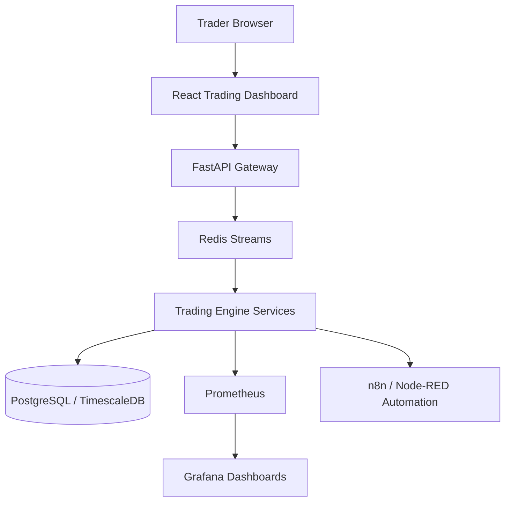

# Infrastructure Architecture

```mermaid
graph TD

User[Trader Browser]

User --> UI[React Trading Dashboard]

UI --> API[FastAPI Gateway]

API --> Redis[Redis Streams]

Redis --> Services[Trading Engine Services]

Services --> Postgres[(PostgreSQL / TimescaleDB)]

Services --> Prometheus[Prometheus]

Prometheus --> Grafana[Grafana Dashboards]

Services --> NodeRed[n8n / Node-RED Automation]
```
