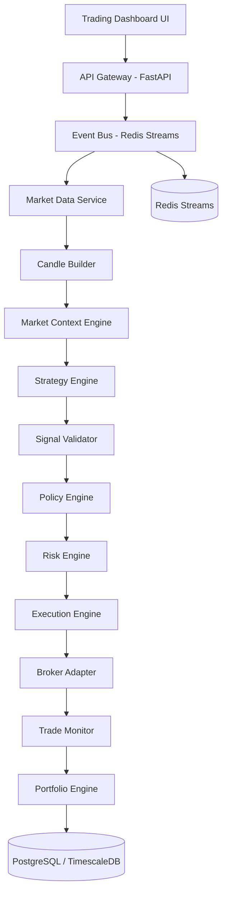

# Trading Platform Architecture

The platform follows a layered architecture.

## System Architecture

```mermaid
graph TD

UI[Trading Dashboard UI]
API[API Gateway - FastAPI]

EventBus[Event Bus - Redis Streams]

MarketData[Market Data Service]
CandleBuilder[Candle Builder]
MarketContext[Market Context Engine]

StrategyEngine[Strategy Engine]
SignalValidator[Signal Validator]

PolicyEngine[Policy Engine]
RiskEngine[Risk Engine]

ExecutionEngine[Execution Engine]
BrokerAdapter[Broker Adapter]

TradeMonitor[Trade Monitor]
PortfolioEngine[Portfolio Engine]

Postgres[(PostgreSQL / TimescaleDB)]
Redis[(Redis Streams)]

UI --> API
API --> EventBus

EventBus --> MarketData
MarketData --> CandleBuilder
CandleBuilder --> MarketContext

MarketContext --> StrategyEngine
StrategyEngine --> SignalValidator

SignalValidator --> PolicyEngine
PolicyEngine --> RiskEngine

RiskEngine --> ExecutionEngine
ExecutionEngine --> BrokerAdapter

BrokerAdapter --> TradeMonitor
TradeMonitor --> PortfolioEngine

PortfolioEngine --> Postgres
EventBus --> Redis
```
