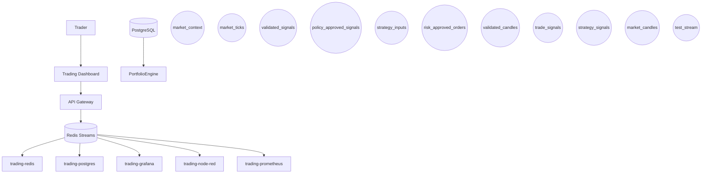

# Full Trading Platform Architecture

Automatically generated architecture map.

```mermaid
graph TD
User[Trader]
UI[Trading Dashboard]
API[API Gateway]
EventBus[(Redis Streams)]
Database[(PostgreSQL)]
User --> UI
UI --> API
API --> EventBus
trading_redis[trading-redis]
EventBus --> trading_redis
trading_postgres[trading-postgres]
EventBus --> trading_postgres
trading_grafana[trading-grafana]
EventBus --> trading_grafana
trading_node_red[trading-node-red]
EventBus --> trading_node_red
trading_prometheus[trading-prometheus]
EventBus --> trading_prometheus
market_context((market_context))
market_ticks((market_ticks))
validated_signals((validated_signals))
policy_approved_signals((policy_approved_signals))
strategy_inputs((strategy_inputs))
risk_approved_orders((risk_approved_orders))
validated_candles((validated_candles))
trade_signals((trade_signals))
strategy_signals((strategy_signals))
market_candles((market_candles))
test_stream((test_stream))
Database --> PortfolioEngine
```